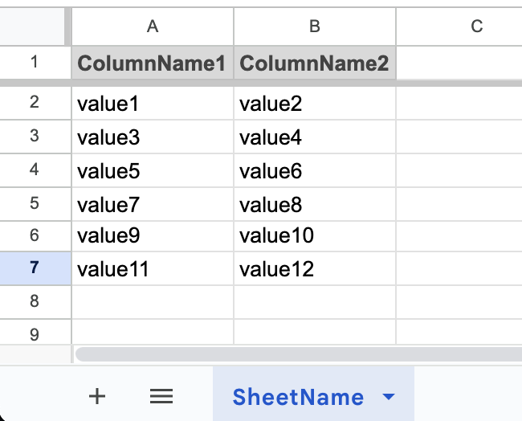

# Model & Controller Template for Google Apps Script
- Using spreadsheet as a database
- Set a spreadsheet ID to the Config.gs file

## Spreadsheet Sample


## Get Data from Spreadsheet

```javascript
const mdl = new Model();

const conditions = [
  { key: "ColumnName1", value: "value1" },
  { key: "ColumnName2", value: "value2" },
  // etc.
];

const offset = 10;
const limit = 5;

const allData = mdl.getData("SheetName");
const dataWithAnd = mdl.getData("SheetName", conditions);
const dataWithOr = mdl.orGetData("SheetName", conditions);
const dataOffsetLimit = mdl.getData("SheetName", null, offset, limit);

Logger.log(allData);
Logger.log(dataWithAnd);
Logger.log(dataWithOr);
Logger.log(dataOffsetLimit);
```

### Use other spreadsheets

```javascript
const mdl = new Model("9Lnk1lZhQ9Hr8IMt60FIbDwLSlv5jlu9");
```

### Insert Data into Spreadsheet

```javascript
const mdl = new Model();

const keyValuePairs = [
  {
    "ColumnName1": "value1-1",
    "ColumnName2": "value2-1",
    // etc.
  },
  {
    "ColumnName1": "value1-2",
    "ColumnName2": "value2-2",
    // etc.
  },
  // etc.
];

const result = mdl.inserData("SheetName", keyValuePairs);

Logger.log(result);
```